# 🚀 AI Detective Case Analysis System

## Overview

An AI-powered forensic investigation system that uses four specialized agents to analyze case evidence and generate comprehensive investigative reports. Upload footprint evidence, submit case details, and receive automated analysis from Physical Evidence, Witness Testimony, Sketch Artist, and Timeline Reconstruction agents.

## How It Works

1. **Upload Footprint Evidence** (optional)
   - Upload footprint image with ID, gender, brand, model, and size
   - Image is converted to 512-dimension vector embedding
   - Stored in Snowflake database for future RAG retrieval

2. **Submit Case Details**
   - Provide incident overview, suspect information, physical evidence, witness testimony, and leads
   - Optionally attach evidence image for RAG retrieval

3. **LangGraph Orchestration**
   - Four agents execute in sequence on case data
   - Each agent analyzes specific aspect and generates report
   - Results aggregated into final comprehensive report

4. **Review Reports**
   - Physical Evidence Report (with similar case references)
   - Witness Testimony Report
   - Sketch Artist Report (suspect description)
   - Timeline Report
   - Concluding Report with investigation summary

## 🔄 Multi-Agent Orchestration Flow

```mermaid
graph TD
    Start([Case Data Input]) --> PhysEvi["<b>🔬 Physical Evidence Agent</b><br/>Analyzes forensic findings<br/>Queries RAG for similar cases"]
    
    PhysEvi --> WitAgent["<b>👥 Witness Testimony Agent</b><br/>Evaluates witness statements<br/>Identifies inconsistencies"]
    
    WitAgent --> SketchArt["<b>🎨 Sketch Artist Agent</b><br/>Extracts suspect descriptions<br/>Organizes physical features"]
    
    SketchArt --> TimelineAgent["<b>⏰ Timeline Reconstruction Agent</b><br/>Reconstructs event sequence<br/>Identifies conflicts & gaps"]
    
    TimelineAgent --> Conclude["<b>📊 Concluding Report Generator</b><br/>Aggregates all findings<br/>Creates formatted output"]
    
    Conclude --> End([Final Report])
    
    style Start fill:#667eea,stroke:#333,stroke-width:2px,color:#fff
    style PhysEvi fill:#4a90e2,stroke:#333,stroke-width:2px,color:#fff
    style WitAgent fill:#4a90e2,stroke:#333,stroke-width:2px,color:#fff
    style SketchArt fill:#4a90e2,stroke:#333,stroke-width:2px,color:#fff
    style TimelineAgent fill:#4a90e2,stroke:#333,stroke-width:2px,color:#fff
    style Conclude fill:#f5576c,stroke:#333,stroke-width:2px,color:#fff
    style End fill:#667eea,stroke:#333,stroke-width:2px,color:#fff
```

## 🗄️ Evidence Upload & RAG Integration

```mermaid
graph LR
    Upload["<b>📁 Upload Footprint</b><br/>ID, Gender, Brand,<br/>Model, Size, Image"]
    
    Upload --> Embed["<b>🔀 Embedding Generation</b><br/>Image → 512-dim Vector"]
    
    Embed --> DB["<b>🗄️ Snowflake Database</b><br/>Vector + Metadata Storage"]
    
    Analysis["<b>Case Analysis</b><br/>Physical Evidence Agent"]
    
    Analysis --> RAG["<b>🔍 RAG Query</b><br/>Find Top-3 Similar Cases"]
    
    DB -.->|Vector Search| RAG
    
    RAG --> Report["<b>📊 Enhanced Report</b><br/>With Similar Cases Context"]
    
    style Upload fill:#667eea,stroke:#333,stroke-width:2px,color:#fff
    style Embed fill:#4a90e2,stroke:#333,stroke-width:2px,color:#fff
    style DB fill:#764ba2,stroke:#333,stroke-width:2px,color:#fff
    style Analysis fill:#4a90e2,stroke:#333,stroke-width:2px,color:#fff
    style RAG fill:#f5576c,stroke:#333,stroke-width:2px,color:#fff
    style Report fill:#667eea,stroke:#333,stroke-width:2px,color:#fff
```

## 📊 Expected Report Output

**Physical Evidence Report**
- Forensic findings analysis
- Evidence significance and implications
- Similar case references from database
- Cross-references with incident context

**Witness Testimony Report**
- Statement credibility assessment
- Consistency and inconsistencies
- Conflicts with case context
- Key observations and uncertainties

**Sketch Artist Report**
- Suspect physical description
- Height, build, age, race/ethnicity
- Facial features and distinguishing marks
- Clothing and accessories
- Unique identifiers

**Timeline Report**
- Chronological event sequence
- Time-stamped key events
- Logical conflicts and gaps
- Missing time windows
- Event correlations

**Concluding Report**
- Case overview summary
- Target information
- Aggregated findings from all agents
- Investigation statistics
- Total reports generated
